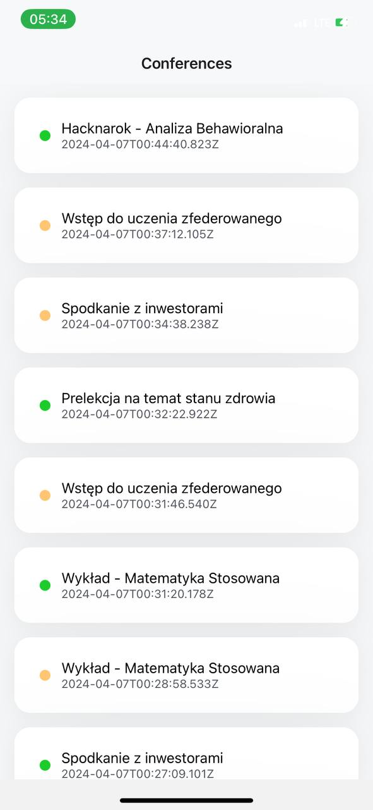
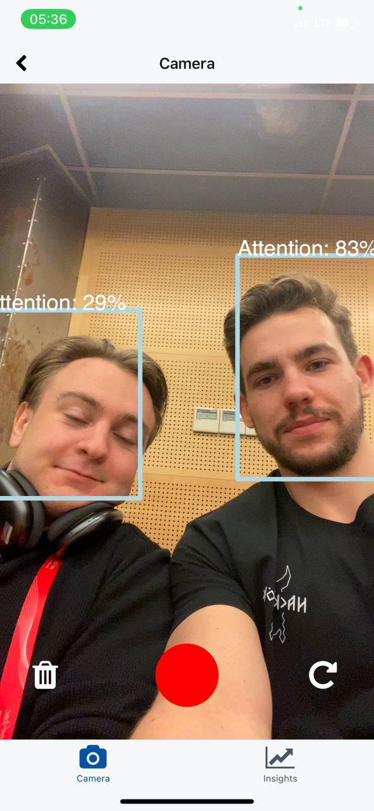
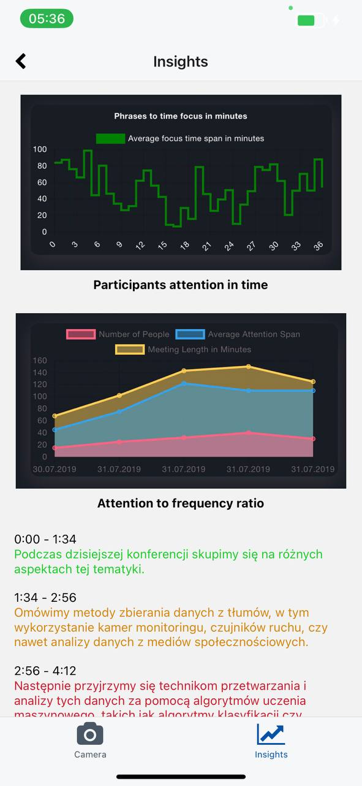

# Odin's Eye - Mobile App

### Abstract

This is a mobile app used for the Odin's Eye project. It uses machine learning techniques and mobile camera to real-time detection people faces and postures characteristics. Then the data is used to calculate the user's attention. Further processing for text-to-speech and correlation of attention with speaker phrases is done on the backend side where video file is uploaded.

### Quick Go Through

On the first screen speaker can select from previously configured conferences. If the conference was not registered yet speaker has possibility to start attention detection for a new conference. After submit of recorded video post-conference insights about audience attention are displayed in separate screen.

### Preview

